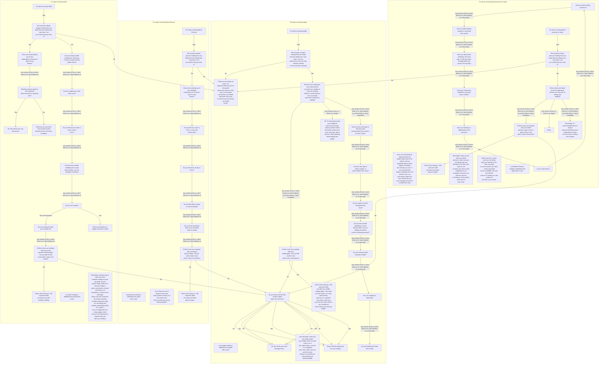

# Decision tree (Mermaid)

```mermaid
flowchart TD
  N3d20a36a["Would you like to speak to the healthcare<br/>team about this or anything else?"]
  N76008409["Are you coughing up more than usual?"]
  Nf7395fb8["Do you use oxygen?"]
  Ne87b422e["We received a blood pressure reading from you<br/>today that has alerted your care team. Can<br/>you confirm that you took it?"]
  N47f0a2b6["Have you been feeling nauseous?"]
  N33cb6d95["Great. Don't hang up. I will wait here while<br/>you take your weight reading again. Just make<br/>sure the scale is on a flat, solid surface,<br/>and not on a carpeted area. Also, make sure<br/>you wear the same clothes you normally do<br/>when taking your morning weight."]
  Na8bcf819["Did you take your blood pressure medication<br/>at least one hour prior to taking your<br/>reading?"]
  Nea6332f9["Have you been feeling weaker or more tired<br/>than usual?"]
  N99b17b50["Ok. It's important to take your weight the<br/>same time each day wearing similar clothes<br/>and shoes to those you wear every day, and to<br/>not eat or drink anything before taking your<br/>weight."]
  N01439d77["Have you needed your oxygen more than usual?"]
  Nc2f10f6b["I'd like to ask you to please take your blood<br/>glucose again. Are you able to take it now<br/>while I wait on the phone?"]
  N4662c721["Great. Don't hang up. I will wait here while<br/>you take your pulse oximeter reading."]
  Nb7b89ac8["Last weight reading is deleted by the agent<br/>with a note."]
  N4c4aba75["Have you felt dizzy or lightheaded in the<br/>past day?"]
  N1ccd68f1["Last glucose reading is deleted by the agent<br/>with a note."]
  N002354ff["Remember, it's recommended that you always<br/>take your blood pressure medications at least<br/>one hour prior to taking your reading."]
  Nddbb82cd["Also, the cuff should be approximately two<br/>fingers above your inner elbow, and you<br/>should be able to fit two fingers in between<br/>the cuff and your arm. If you cannot fit two<br/>fingers in between the cuff and your arm, you<br/>may need a larger cuff size. Please let your<br/>care manager know if this is indeed the case."]
  N0476e462["If you have run out of glucose meter test<br/>strips, please contact your care team soon.<br/>They can help you secure testing supplies."]
  Ne5830a88["I'd like to ask you to please take your pulse<br/>oximeter reading again. Are you able to take<br/>it now while I wait on the phone?"]
  N61717a9e["I'd like to ask you to please take your<br/>weight again. Are you able to take it now<br/>while I wait on the phone?"]
  N4fd96621["Do you feel sick, have a fever, or any new<br/>severe pain?"]
  Nf4dd0423["Is your vision blurry?"]
  N5baea462["Last SpO reading is deleted by the agent with<br/>a note."]
  N82727d75["Did you miss taking any of your diabetes<br/>medications in the past 2 days for any<br/>reason?"]
  Na002192c["Have you had trouble breathing, felt chest<br/>pain, or felt your heart beating faster than<br/>usual in the last day?"]
  N6562ceb6["Great. We'll be looking out for your reading."]
  Nf8d83286["We received a weight reading from you today<br/>that has alerted your care team. Can you<br/>confirm that it was you who took the reading<br/>on the scale this morning?"]
  N66ae94f4["For alerts involving weight"]
  Nddd9fd99["Just remember, when you are ready to take<br/>your weight, make sure the scale is on a<br/>flat, solid surface, and not on a carpeted<br/>area. Also, make sure you wear the same<br/>clothes you normally do when taking your<br/>morning weight."]
  Naab46765["Are you eating less than you normally do?"]
  N405567ab["Do you think you'll be able to take it again<br/>within the next hour?"]
  N5005788a["We received a blood glucose reading from you<br/>today that has alerted your care team. Can<br/>you confirm that you took it?"]
  Ne2eb055c["Great."]
  Naf203c0f["Remember, when you do take your blood<br/>pressure, make sure you are sitting with your<br/>feet flat on the floor, your legs are not<br/>crossed, your back is fully supported as you<br/>sit upright, and your arm with the cuff on it<br/>is resting on a flat surface at the level of<br/>your heart."]
  Ne57105f3["For alerts involving Blood Glucose"]
  N2318dc13["Ok. We will let your Care Manager know."]
  Ne624d44d["Do you feel weak, shaky or dizzy?"]
  N23743314["Do you have trouble breathing at rest or<br/>during activity, such as walking around the<br/>house or dressing yourself?"]
  N0e97afb0["Are you having trouble breathing or wheezing,<br/>or have a cough that has gotten worse?"]
  Nc24ddca1["Have you noticed any swelling in your legs,<br/>feet or ankles?"]
  N9332458f["Have you missed taking any of your<br/>medications in the past 2 days for any<br/>reason?"]
  Na5f9d014["Thank you for letting me know. It is<br/>important that only you as the patient<br/>utilize your device so that your care manager<br/>can monitor your health and reach out to you<br/>to assist if you are having any health<br/>issues."]
  Ne283236d["Did you have anything to eat or drink before<br/>you took your reading or were you wearing<br/>clothes or shoes that you do not normally<br/>wear when taking your reading?"]
  Neb52ea01["Remember, the best way to take your pulse<br/>oximeter reading is to put the probe on your<br/>pointer finger. Make sure that your finger is<br/>warm, your hand is relaxed and there is no<br/>nail polish or acrylic nail on that finger.<br/>Make sure your hand with the sensor attached<br/>is below heart level when you are taking your<br/>reading, preferably resting on a table. If<br/>you are supposed to be using oxygen, make<br/>sure you are wearing your oxygen when you<br/>take your reading."]
  N2aae7c2a["Are you coughing or wheezing?"]
  N908518a1["Are you feeling more tired than usual?"]
  N92ed07ef["I'd like to ask you to please take your blood<br/>pressure again. Are you able to take it now<br/>while I wait on the phone?"]
  N22209470["Have you felt chest pain or felt your heart<br/>beating faster than usual in the last 2 days?"]
  Nfbeab0fc["When you do so, make sure you are sitting<br/>with your feet flat on the floor, your legs<br/>are not crossed, your back is fully supported<br/>as you sit upright, and your arm with the<br/>cuff on it is resting on a flat surface at<br/>the level of your heart."]
  Na95f7b63["Thank you for your time! Your answers will be<br/>relayed to your care team. Goodbye."]
  N190b5a72["Do you feel that you have a cold or have a<br/>fever?"]
  Ncbb48f29["Do you have increased thirst or an increased<br/>need to urinate"]
  Na6fa8e30["Last Blood Pressure reading is deleted by the<br/>agent with a note."]
  N8b285f1f["Great. Don't hang up. I will wait here while<br/>you take your blood pressure again."]
  N6e3d6f00["Are you having trouble sleeping at night?"]
  N527e1cfc["For alerts involving blood pressure or pulse"]
  Nf440b7c0["Great. Don't hang up. I will wait here while<br/>you take your blood glucose again."]
  N925a1065["For alerts involving SpO2"]
  Nae9eae52["We received a blood oxygen reading from you<br/>today that has alerted your care team. Can<br/>you confirm that you took it?"]
  N25322194["Ok. We will let your care team know."]
  N7a9cff40["Do have more trouble breathing than usual<br/>with activities, such as bathing or dressing?"]
  Nc7e39cb1["Do your pants or shoes feel tighter than<br/>usual?"]
  Ne8f8a86c["Do you feel either sweaty or cold and damp?"]
  Nae3eb661["Are your feet, legs or ankles swollen, or<br/>more swollen than usual?"]
  subgraph N66ae94f4_group["For alerts involving weight"]
    N22209470
    N2318dc13
    N23743314
    N2aae7c2a
    N33cb6d95
    N405567ab
    N61717a9e
    N6562ceb6
    N66ae94f4
    N6e3d6f00
    N908518a1
    N99b17b50
    Na5f9d014
    Nae3eb661
    Nb7b89ac8
    Nc7e39cb1
    Nddd9fd99
    Ne283236d
    Nf8d83286
    Nf8d83286 -->|No| Na5f9d014
    N61717a9e -->|Yes| N33cb6d95
    N2aae7c2a -->|Any version of No or I don't think so or I don't believe so or Not really| N908518a1
    N405567ab -->|No| N2318dc13
    N405567ab -->|Yes| N6562ceb6
    Nc7e39cb1 -->|Any version of No or I don't think so or I don't believe so or Not really| N23743314
    Ne283236d -->|Any version of No or I don't think so or I don't believe so or Not really or I don't remember| N61717a9e
    N66ae94f4 -->|start| Nf8d83286
    Ne283236d -->|Any version of yes or I think so or maybe| N99b17b50
    N6e3d6f00 -->|Any version of No or I don't think so or I don't believe so or Not really| N2aae7c2a
    N61717a9e -->|No| N405567ab
    Nae3eb661 -->|Any version of No or I don't think so or I don't believe so or Not really| Nc7e39cb1
    Nf8d83286 -->|Yes| Ne283236d
    N22209470 -->|Any version of No or I don't think so or I don't believe so or Not really| Nae3eb661
    N23743314 -->|Any version of No or I don't think so or I don't believe so or Not really| N6e3d6f00
    Ne283236d -->|Any version of No or I don't think so or I don't believe so or Not really or I don't remember| N22209470
  end
  subgraph N527e1cfc_group["For alerts involving blood pressure or pulse"]
    N002354ff
    N2318dc13
    N405567ab
    N47f0a2b6
    N4c4aba75
    N527e1cfc
    N6562ceb6
    N8b285f1f
    N92ed07ef
    Na002192c
    Na5f9d014
    Na6fa8e30
    Na8bcf819
    Naf203c0f
    Nc24ddca1
    Nddbb82cd
    Ne2eb055c
    Ne87b422e
    Nea6332f9
    Nf4dd0423
    Nfbeab0fc
    N405567ab -->|No| N2318dc13
    Na8bcf819 -->|Any version of No or I don't think so or I don't believe so or Not really or I don't remember| N92ed07ef
    Nc24ddca1 -->|Any version of No or I don't think so or I don't believe so or Not really| N4c4aba75
    N47f0a2b6 -->|Any version of No or I don't think so or I don't believe so or Not really| Nea6332f9
    Nea6332f9 -->|Any version of No or I don't think so or I don't believe so or Not really| Na002192c
    N405567ab -->|Yes| N6562ceb6
    Ne87b422e -->|No| Na5f9d014
    N527e1cfc -->|start| Ne87b422e
    Ne87b422e -->|Yes| Na8bcf819
    N92ed07ef -->|Yes| N8b285f1f
    N4c4aba75 -->|Any version of No or I don't think so or I don't believe so or Not really| Nf4dd0423
    Na002192c -->|Any version of No or I don't think so or I don't believe so or Not really| Nc24ddca1
    N92ed07ef -->|No| N405567ab
    Na8bcf819 -->|Any version of yes or I think so or maybe| Ne2eb055c
    Na8bcf819 -->|Any version of No or I don't think so or I don't believe so or Not really or I don't remember| N002354ff
    Nf4dd0423 -->|Any version of No or I don't think so or I don't believe so or Not really| N47f0a2b6
  end
  subgraph Ne57105f3_group["For alerts involving Blood Glucose"]
    N0476e462
    N1ccd68f1
    N2318dc13
    N405567ab
    N4fd96621
    N5005788a
    N6562ceb6
    N82727d75
    Na5f9d014
    Nc2f10f6b
    Ncbb48f29
    Ne57105f3
    Ne624d44d
    Ne8f8a86c
    Nf440b7c0
    N405567ab -->|No| N2318dc13
    Ne8f8a86c -->|Any version of No or I don't think so or I don't believe so| Ncbb48f29
    Ncbb48f29 -->|Any version of No or I don't think so or I don't believe so| Nc2f10f6b
    N405567ab -->|Yes| N6562ceb6
    N4fd96621 -->|Any version of No or I don't think so or I don't believe so| Ne624d44d
    Nc2f10f6b -->|Yes| Nf440b7c0
    Ne624d44d -->|Any version of No or I don't think so or I don't believe so| Ne8f8a86c
    N82727d75 -->|Any version of No or I don't think so or I don't believe so| N4fd96621
    Nc2f10f6b -->|No| N405567ab
    N5005788a -->|Yes| N82727d75
    Ne57105f3 -->|start| N5005788a
    N5005788a -->|No| Na5f9d014
  end
  subgraph N925a1065_group["For alerts involving SpO2"]
    N01439d77
    N0476e462
    N0e97afb0
    N190b5a72
    N2318dc13
    N25322194
    N3d20a36a
    N405567ab
    N4662c721
    N5baea462
    N6562ceb6
    N76008409
    N7a9cff40
    N925a1065
    N9332458f
    Na5f9d014
    Na95f7b63
    Naab46765
    Nae9eae52
    Ne5830a88
    Neb52ea01
    Nf7395fb8
    N190b5a72 -->|Any version of No or I don't think so or I don't believe so| N7a9cff40
    Nae9eae52 -->|Yes| N9332458f
    N405567ab -->|No| N2318dc13
    N0e97afb0 -->|Any version of No or I don't think so or I don't believe so| N76008409
    Nae9eae52 -->|Yes| N0e97afb0
    N7a9cff40 -->|Any version of No or I don't think so or I don't believe so| Nf7395fb8
    Naab46765 -->|Any version of No or I don't think so or I don't believe so| Ne5830a88
    N405567ab -->|Yes| N6562ceb6
    N3d20a36a -->|Yes| N25322194
    Ne5830a88 -->|Yes| N4662c721
    Nf7395fb8 -->|No or Not anymore| Naab46765
    N925a1065 -->|start| Nae9eae52
    Nf7395fb8 -->|Yes| N01439d77
    N9332458f -->|Any version of No or I don't think so or I don't believe so| N3d20a36a
    Nae9eae52 -->|No| Na5f9d014
    Ne5830a88 -->|No| N405567ab
    N3d20a36a -->|No| Na95f7b63
    N76008409 -->|Any version of No or I don't think so or I don't believe so| N190b5a72
  end
```
